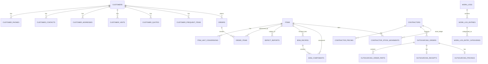

# Canonical Data Model — Draft

> Project: Chihyuan Enterprise Management System (CY Web)
>
> Status: architecture draft based on the completed Legacy source/header audit. This document is **not** a governance rules source and is not yet a final D1 migration.

## 1. Objective

CY Web must replace the Legacy pattern of module-specific Sheets and module-specific field names with one canonical enterprise data model.

Core rule:

> One business entity + one semantic meaning = one canonical field name and one authoritative source.

Modules may reference an entity; they must not silently create a second customer/item/employee/contractor master under another field name.

Intentional historical snapshots are allowed, but they must be explicit (`*_snapshot`) and justified by business history requirements.

## 2. Naming conventions

### 2.1 Database

D1/SQL columns use `snake_case`.

Examples:

- `customer_id`
- `customer_no`
- `owner_employee_id`
- `created_at`

### 2.2 API / TypeScript

TypeScript can use `camelCase` through a single mapper/schema layer, for example `customerId`, but the semantic name must stay one-to-one with the database contract.

Do not create alternative semantic aliases such as `clinicId`, `custId`, `customerCode`, `customerNo` for the same concept in different modules.

### 2.3 Stable internal ID vs business number

Each major entity should have an internal stable `id` that does not change when a user-visible number/name changes.

Business-facing numbers remain separate unique attributes where applicable.

Example:

```text
customers.id           internal immutable key
customers.customer_no  user-facing customer number
customers.short_name   user-facing short name
customers.full_name    user-facing full name
```

Legacy hidden IDs such as `C00001` and `I000001` should be imported as traceability/migration identifiers if needed, not reused as the meaning of user-facing customer/item numbers.

## 3. Reference vs snapshot policy

A foreign key answers **which entity** the record belongs to.

A snapshot answers **what the transaction displayed/agreed at that historical moment**.

Example order line:

```text
item_id                 -> current Item master relation
item_no_snapshot        -> item number printed/used on that order
item_name_snapshot      -> item name at that time
spec_snapshot           -> item spec at that time
unit_snapshot           -> unit at that time
unit_price              -> transaction price
```

This is intentionally different from accidental duplication such as copying customer short name into every module only to avoid a join.

## 4. Identity / application membership

CY Web should not recreate the Legacy six-digit PIN Users table as the primary identity system.

Current direction:

- shared identity authority: CYInvoice Cloud-compatible account authority through an adapter;
- medium term: CYCloud Identity;
- CY Web app-specific roles/permissions remain separate from global identity membership.

Proposed local application tables/contracts:

### `app_members`

- `id`
- `identity_employee_id` — stable external identity subject/reference
- `employee_no` — optional application/company employee number
- `is_active`
- `created_at`, `updated_at`

Display name/email should come from the identity contract or a deliberately documented cache, not be used as foreign keys.

### `app_role_assignments` / `app_permission_grants`

App-specific authorization only. Do not map Legacy `admin/staff/sales/warehouse` directly onto a global identity role without an explicit compatibility mapping.

## 5. Reference/lookup data

Candidate lookup entities:

- `departments`
- `customer_categories`
- `customer_statuses`
- `item_categories` (supports parent/child hierarchy)
- `log_categories`
- `log_platforms`
- typed scoring configuration tables

Each configurable lookup should have a stable key/ID distinct from its editable display label.

This prevents a label rename from changing the semantic identity of historical records.

## 6. Customer domain

### `customers`

Candidate fields:

- `id`
- `legacy_customer_id` — migration traceability only
- `customer_no`
- `short_name`
- `full_name`
- `tax_id`
- `customer_category_id`
- `region` or `region_id` (`OPEN`)
- `owner_department_id`
- `owner_employee_id`
- `fax`
- `customer_status_id`
- `created_at`, `updated_at`, `created_by`, `updated_by`, `revision`

Candidate constraints:

- `customer_no`: `UNIQUE` is strongly recommended, final mutability rule is `OPEN`;
- `tax_id`: text, not numeric; uniqueness depends on business policy and nullable behavior.

### `customer_phones`

- `id`
- `customer_id`
- `phone_number`
- `extension`
- `note`
- `sort_order`

### `customer_contacts`

- `id`
- `customer_id`
- `name`
- `department_name`
- `title`
- `mobile`
- `sort_order`

`department_name` here is a customer-contact department and is deliberately **not** `owner_department_id`.

### `customer_addresses`

- `id`
- `customer_id`
- `postal_code`
- `address`
- `note`
- `sort_order`

### `customer_notes`

- `id`
- `customer_id`
- `content`
- `sort_order`
- audit timestamps

This replaces the fixed three-string JSON array while preserving ordered highlighted notes.

### `customer_visits`

- `id`
- `legacy_visit_id`
- `customer_id`
- `visit_date`
- `contact_person`
- `employee_id`
- `content`
- audit fields

### `customer_quotes`

A Legacy quote currently refers to one customer + one item.

Candidate fields:

- `id`
- `legacy_quote_id`
- `customer_id`
- `item_id`
- `quote_date`
- `employee_id`
- optional explicit customer/item snapshot fields once snapshot policy is confirmed
- audit fields

### `quote_price_breaks`

- `id`
- `quote_id`
- `quantity`
- `unit`
- `unit_price`
- `note`
- `sort_order`

### `customer_frequent_items`

- `id`
- `customer_id`
- `item_id` nullable
- `custom_item_name` nullable
- optional `item_no_snapshot`, `item_name_snapshot`, `spec_snapshot`, `category_snapshot` for imported legacy/custom data
- `sort_order`

This intentionally supports the Legacy ability to record an unfiled frequent product.

## 7. Item domain

### `items`

- `id`
- `legacy_item_id`
- `item_no`
- `name`
- `spec`
- `base_unit`
- `item_category_id`
- `cost`
- `cost_tax_mode` — stable code such as `none / tax_included / tax_excluded`
- `store_price`
- `clinic_price`
- `notes`
- audit fields

Candidate constraint: `item_no` should normally be `UNIQUE`; edit/alias policy is `OPEN`.

### `item_unit_conversions`

- `id`
- `item_id`
- `from_unit`
- `quantity`
- `to_unit`
- `sort_order`

Validation must reject cycles and unresolved target units, preserving current Legacy behavior.

### Item change history

Do not recreate the misleading `priceLog` column.

General item changes should be represented by `audit_events`. If future reporting needs structured price analytics, introduce a specific price-history projection/table rather than storing free-form combined text as the primary record.

## 8. Defect domain

### `defect_reports`

- `id`
- `legacy_defect_id`
- `reported_date`
- `customer_id`
- `item_id`
- `owner_employee_id`
- `defect_description`
- `handling`
- `status_code` (`created / processing / resolved` candidate)
- explicit customer/item snapshot fields only where approved
- audit fields

Legacy free-text `logs[]` should migrate into audit events linked to the defect entity.

## 9. Order domain

### `orders`

- `id`
- `legacy_order_id` or canonical business order number field, depending final ID policy
- `customer_id`
- `order_date`
- `operator_employee_id`
- `note`
- `status_code`
- `erp_no`
- `hide_price_on_sales_document` boolean
- `invoice_type` nullable stable code
- `receipt_option` nullable stable code
- audit fields

Legacy `custNo` and `custshortName` should not remain ambiguous master duplicates on the order header.

If historical customer display must be frozen, use explicit `customer_no_snapshot` / `customer_name_snapshot` fields after business approval.

### `order_items`

- `id`
- `order_id`
- `item_id` nullable only for a deliberately supported unfiled line
- `item_no_snapshot`
- `item_name_snapshot`
- `spec_snapshot`
- `quantity`
- `unit_snapshot`
- `unit_price`
- `note`
- `sort_order`

Order item snapshots are recommended because item master changes must not silently rewrite the meaning of a historical order.

### Order workflow candidate codes

Legacy presentation strings map to stable codes:

| Legacy label | Candidate code |
| --- | --- |
| 已建檔 | `created` |
| 已出單 | `issued` |
| 等到貨 | `waiting_stock` |
| 已撿貨 | `picked` |
| 已出貨 | `shipped` |

Emoji/color remain UI presentation.

## 10. BOM / manufacturing recipe domain

The Legacy `Materials` table should not become a D1 table named `materials` with the same ambiguous meaning.

### `bom_recipes`

- `id`
- `legacy_material_id`
- `finished_item_id`
- `output_quantity`
- `output_unit`
- audit fields

Finished name/spec come from the Item relation unless an explicit snapshot/version requirement is later approved.

### `bom_components`

- `id`
- `bom_recipe_id`
- `component_item_id`
- `quantity`
- `unit`
- `sort_order`

This replaces `finId/finName/finSpec` plus `parts[]` copies with explicit item relationships.

## 11. Contractor domain

### `contractors`

- `id`
- `legacy_contractor_id`
- `name`
- `phone`
- `address`
- `note`
- `is_active`
- audit fields

`OPEN`: determine whether the business concept may represent companies/vendors as well as individuals; if yes, expand contact fields intentionally instead of adding ad hoc fields such as old Mobile `cell`.

### `contractor_pricing`

- `id`
- `contractor_id`
- `item_id`
- `unit`
- `unit_price`
- `note`
- effective/updated timestamps as needed

Names/specs should not be used as the relationship key. Historical paid/priced outsourcing records keep their own pricing snapshots.

## 12. Outsourcing domain

### `outsourcing_orders`

- `id`
- `legacy_outsourcing_id`
- `status_code`
- `operator_employee_id`
- `contractor_id`
- `order_date`
- `outbound_date`
- audit fields

Candidate workflow codes:

| Legacy label | Candidate code |
| --- | --- |
| 待出庫 | `pending_outbound` |
| 已出庫 | `outbound` |
| 已入庫 | `received` |
| 已計價 | `priced` |
| 已付款 | `paid` |

Drop `isPriced` as an independent truth source. Pricing existence/status and payment status are explicit domain facts.

### `outsourcing_order_parts`

Candidate fields:

- `id`
- `outsourcing_order_id`
- `bom_recipe_id` nullable
- `finished_item_id` nullable
- `component_item_id`
- `quantity`
- `unit`
- `note`
- explicit snapshots needed to reproduce the historical outbound document
- `sort_order`

### `outsourcing_receipts`

- `id`
- `outsourcing_order_id` unique
- `received_date`
- `operator_employee_id`
- audit fields

### `outsourcing_receipt_items`

- `id`
- `receipt_id`
- `item_id`
- `quantity`
- `unit`
- `note`
- item snapshots if needed
- `sort_order`

### `outsourcing_pricings`

- `id`
- `outsourcing_order_id` unique for current Legacy behavior
- `priced_date`
- `operator_employee_id`
- `total_amount`
- audit fields

### `outsourcing_pricing_items`

- `id`
- `pricing_id`
- `item_id`
- `item_no_snapshot`
- `item_name_snapshot`
- `unit_snapshot`
- `quantity`
- `unit_price`
- `subtotal`
- `note`
- `sort_order`

## 13. Contractor stock / inventory ledger

The Legacy system can rebuild `materialStock` from outbound supply, receiving consumption and manual adjustment logs. The new system should make movements authoritative.

### `contractor_stock_movements`

- `id`
- `contractor_id`
- `item_id` — component/part Item
- `movement_type` — e.g. `outbound_supply`, `receipt_consumption`, `manual_adjustment`, `migration_opening`
- signed `quantity_delta`
- `occurred_at`
- `operator_employee_id`
- `outsourcing_order_id` nullable
- `reason` nullable
- metadata for imported legacy references if needed

Current stock is derived by `SUM(quantity_delta)` grouped by contractor/item.

This removes three competing sources of truth (`materialStock`, `StockAdjustLogs`, reconstructed order math).

If performance later requires a balance cache, it must be transactional/derived and never become a second independent authority.

## 14. Work-log domain

The current Desktop work-log data is queryable/scorable and should not remain one opaque `content` JSON cell.

### `work_logs`

- `id`
- `legacy_log_id`
- `work_date`
- `date_from` nullable
- `date_to` nullable
- `single_day` boolean
- `work_days` numeric/integer according to confirmed business behavior
- `type_code`
- `employee_id`
- `status_code`
- audit fields

Candidate status codes:

- `created`
- `pending_review`
- `reviewed`

### `work_log_entries`

- `id`
- `work_log_id`
- `entry_type` (`platform` / `advertising` candidate)
- `content`
- `platform_id` nullable
- `remark` nullable
- `score` nullable
- `sort_order`

### `work_log_entry_categories`

- `id`
- `work_log_entry_id`
- `log_category_id`
- `quantity`

Boolean category selection can be represented by an existing row with quantity `1`; quantity-bearing categories store the actual quantity. This avoids separate boolean-vs-number schemas for the same category relation.

### Scoring configuration

Current `logScoring` stores fixed category rules, custom `_extra` rows and `_minAvgScore` inside one JSON object.

Proposed split:

- `log_scoring_rules`
- stable relation to category/custom rule identity
- score, description, note, active/order fields
- application setting for minimum average score

Exact scoring schema should be finalized together with the history-statistics query requirements.

## 15. Audit / history

### `audit_events`

Cross-module structured audit source:

- `id`
- `entity_type`
- `entity_id`
- `action`
- `actor_employee_id`
- `occurred_at`
- `request_id` / correlation ID where available
- `metadata_json` for non-relational before/after detail or migrated Legacy text

Use JSON here only as event detail metadata; entity relationships and query-critical fields stay relational.

Legacy `history`, `logs`, `priceLog` and `DeleteLogs` should be imported as historical audit material where useful, not recreated as separate free-text truth stores.

## 16. Migration traceability

### `legacy_id_map`

Candidate columns:

- `source_entity`
- `legacy_id`
- `new_id`
- optional `source_sheet`
- migration batch/version

This allows repeatable imports and reconciliation without making Legacy IDs the new application primary keys.

A dedicated mapping table also helps handle aliases such as old `customerNo`/`shortName` and legacy ID-format variants encountered during value-level profiling.

## 17. Recommended relationship overview



## 18. Constraints/indexes to plan in the D1 draft

Candidate requirements:

- unique indexes on stable business numbers where approved (`customer_no`, `item_no`);
- FKs/indexes on all `*_id` relationships;
- indexes for date/status/owner filters used by lists;
- composite indexes for common history queries, e.g. customer + date, employee + work date;
- optimistic concurrency via `revision` on mutable business records;
- server-side schema validation before D1 writes;
- money/quantity precision rules defined before SQL schema is frozen;
- date-only fields stored consistently as `YYYY-MM-DD`; timestamps stored in UTC.

## 19. Decisions intentionally not frozen yet

`OPEN` items before SQL migration files are written:

1. customer/item business-number immutability and alias policy;
2. exact snapshot fields for Quote/Order/Defect/Outsourcing;
3. contractor person-vs-company semantics;
4. region model;
5. which lookup labels remain administrator-editable;
6. money precision / rounding policy per module;
7. exact WorkLog scoring/reporting relational shape;
8. whether imported Legacy generated IDs remain visible to users or only migration metadata.

These decisions should be resolved with user-facing business examples, not by asking the user to interpret old variable names.

## 20. Implementation gate

Do **not** build the production D1 schema by copying the Legacy Sheet headers.

The next gate is:

1. value-level read-only profiling (counts, duplicates, nulls, orphan relations, old aliases);
2. user review of the `OPEN` business semantics;
3. final Data Dictionary;
4. D1 SQL schema/migrations;
5. repeatable dry-run importer + reconciliation report;
6. only after successful verification, module implementation/cutover.

The existing GAS Sheet/deployment remains untouched during this process.
